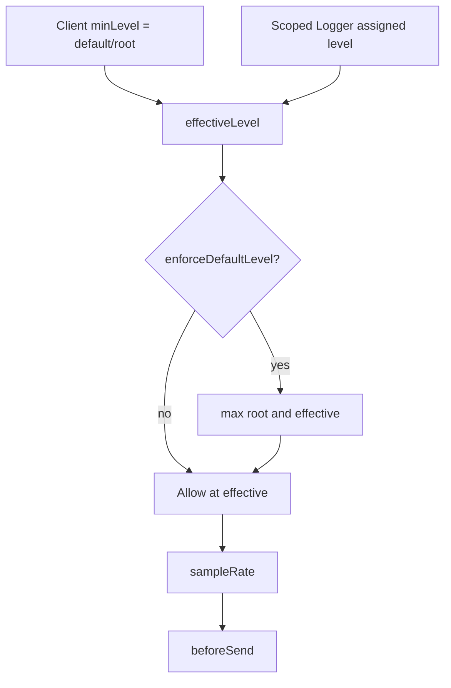

# Logger levels and hierarchy

Talaria uses a **Logback / Microsoft.Extensions.Logging-style** hierarchy: client `minLevel` is the **default/root**, and scoped loggers can override it (including becoming more verbose). An opt-in hard floor restores the older “raise only” behaviour.

Same semantics apply to the PHP SDK and `@newtalaria/browser`.

---

## Previous behaviour (why it was limiting)

Effective level was:

```text
effectiveLevel = max(clientMinLevel, loggerMinLevel)
```

A child logger could only become **more restrictive**. Configuration like “warning globally, info for Business Directory” was impossible without custom `beforeSend` filtering — the client rejected `info` before it could send.

That matched **sink raise-only** semantics, not how Logback, MEL, Serilog Override, Pino, or Bunyan treat named/child loggers.

---

## New hierarchy

```text
effectiveLevel(logger) =
  logger.assignedMinLevel
  ?? parent.assignedMinLevel   // via child() / with* copying scope
  ?? client.minLevel           // default / root

if client.enforceDefaultLevel:
  effectiveLevel = max(client.minLevel, effectiveLevel)
```

| Knob | Default | Role |
| --- | --- | --- |
| `minLevel` | `debug` (core) / `warning` (Silverstripe YAML) | Default/root for unset scopes; filters **direct** client captures |
| `enforceDefaultLevel` | `false` | Opt-in hard floor (legacy `max()` safety) |
| Scoped `minLevel` | unset → inherit | Assigned override — may be higher **or** lower than root |
| `sampleRate` → `beforeSend` | unchanged | After the level gate |



### Inheritance rules

1. Unset scope → inherits client `minLevel`.
2. Explicit `minLevel` on `logger` / `child` / `withMinLevel` **assigns** (replaces) — does not `max` with the parent.
3. Direct `Talaria::info()` / `client.captureMessage` always use client `minLevel` (they are the root path).
4. Scoped captures skip the client floor unless `enforceDefaultLevel` is true (the logger already applied `effectiveLevel`).

### Examples

With `minLevel: warning`, `enforceDefaultLevel: false`:

| Logger | Effective level |
| --- | --- |
| Default / unset | `warning` |
| `logger(['minLevel' => 'info'])` | `info` |
| `child(['minLevel' => 'error'])` | `error` |
| After raise, `child(['minLevel' => 'debug'])` | `debug` |
| Direct `Talaria::info(...)` | filtered (`warning` root) |

With `enforceDefaultLevel: true` and `minLevel: warning`, every path is clamped to ≥ `warning`.

---

## Named logger presets

```php
Talaria::init([
    'minLevel' => 'warning',
    'enforceDefaultLevel' => false,
    'loggers' => [
        'businessDirectory' => [
            'minLevel' => 'info',
            'tags' => ['area' => 'businessDirectory'],
        ],
    ],
    // …
]);

Talaria::logger('businessDirectory')->info('Listing loaded');
Talaria::logger([
    'name' => 'businessDirectory',
    'tags' => ['request' => 'x'],
])->info('…'); // merges tags over the preset
```

Silverstripe YAML:

```yaml
Talaria\SilverStripe\Config:
  minLevel: warning
  enforceDefaultLevel: false
  loggers:
    businessDirectory:
      minLevel: info
      tags:
        area: businessDirectory
```

---

## Monolog (Approach A)

The Talaria Monolog handler is **out of the hierarchy**. It only respects the **global default** `minLevel` (YAML / client). Per-area verbosity requires Approach B (`Talaria\Logger` or named presets).

---

## Migration guide

| Scenario | Action |
| --- | --- |
| No scoped `minLevel` | No change in volume |
| Scoped `minLevel` stricter than client | Still works |
| Scoped `minLevel` looser than client (previously ignored) | **Starts sending** — intended; set `enforceDefaultLevel: true` to refuse |
| Want old global hard floor | `enforceDefaultLevel: true` |
| Want warning default + info for one area | `minLevel: warning`, `enforceDefaultLevel: false`, named logger or `logger(['minLevel' => 'info'])` |
| Monolog-only apps | Handler stays at global `minLevel`; use `Talaria\Logger` for per-area verbosity |
| SS browser inject | Injected options now include `minLevel` / `enforceDefaultLevel` / `loggers` (may reduce browser volume vs the previous implicit browser `debug` when YAML said `warning`) |

### Backwards-compatibility risks

1. Scoped levels below client `minLevel` now emit when enforce is off (intentional).
2. `withMinLevel` **assigns** instead of maxing with the parent — weakening after a raise works.
3. Silverstripe default remains `warning` for unset scopes / Monolog.
4. Direct client APIs still gated by `minLevel`.

---

## Browser parity (`@newtalaria/browser`)

```ts
Talaria.init({
  minLevel: 'warning',
  enforceDefaultLevel: false,
  loggers: {
    businessDirectory: {
      minLevel: 'info',
      tags: { area: 'businessDirectory' },
    },
  },
  // …
});

Talaria.logger('businessDirectory');
Talaria.logger({ name: 'businessDirectory', tags: { request: 'x' } });
```

Option names and inheritance rules match the PHP SDK.
